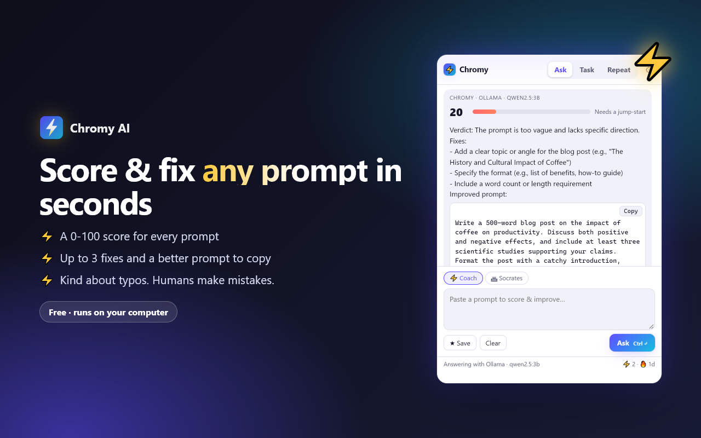

<p align="center"></p>

<h1 align="center">Chromy AI ⚡ Ask / Task / Repeat</h1>

<p align="center"><b>Your prompts, electrified.</b> A free AI prompt coach for Chrome that runs on <i>your own computer</i>.<br>
Score and fix any prompt, let Socrates question it, run it on the page you're reading, and repeat your favourites in one click.</p>

<p align="center">
  <a href="https://github.com/shatadip/Chromy-AI/actions/workflows/ci.yml"></a>
  
  
  <a href="LICENSE"></a>
</p>

<p align="center"></p>

## Why people like it

- **💬 Ask anything:** questions get a straight answer plus a 💡 tip on how to ask even better.
- **⚡ Prompt score (0-100)** for prompts you'll send to an AI, with up to 3 concrete fixes and a better prompt you can copy.
- **🏛 Socrates mode:** three sharp questions instead of answers, so you find out what you actually want.
- **🤔 Question it:** one click makes the AI examine its own answer for mistakes. Humans make mistakes; so do AIs.
- **📄 Task on any page:** summarise, explain like I'm 12, extract, or humanize text, on the tab you're reading.
- **★ Repeat:** save prompts and re-run them in one click (starter prompts included).
- **🧠 Short memory:** follow-ups just work; one click to forget.
- **🔒 Private by default:** with local AI, prompts never leave your computer. No account, no tracking, no bill.
- **🌍 Chromy around the world:** a spinning globe of where Chromy is used (aggregate store numbers; the extension collects nothing).

## Free local AI, set up in 2 clicks

On install, Chromy opens a guided setup simple enough for a 10-year-old:

1. **Allow** Chromy to talk to the AI on your computer.
2. **Install Ollama** (one download button; Chromy notices when it's running).
3. **Download a brain.** Chromy picks the best model for your computer's memory and downloads it with a progress bar. No terminal.
4. **Say hi.** 👋

Got a newer PC? Chrome's own **on-device AI** works too, with zero installs.

| Engine | Cost | Needs | Web search |
|---|---|---|---|
| **Chrome on-device AI** (Gemini Nano) | Free | Recent Chrome, >4 GB VRAM or 16 GB RAM | – |
| **Ollama** (local, recommended) | Free | [Ollama](https://ollama.com/download) + a model (guided) | – |
| **Gemini** (your key) | Free tier / paid | [AI Studio key](https://aistudio.google.com/app/apikey) | ✓ |
| **Claude** (your key) | Paid | [Anthropic key](https://console.anthropic.com/settings/keys) | ✓ |
| **OpenAI** (your key) | Paid | [OpenAI key](https://platform.openai.com/api-keys) | – |

**Always answers:** Chromy tries your preferred engine first and quietly falls back to the next working one (not installed, offline, over quota: skipped). Every answer says which engine produced it. Models are chosen automatically (biggest that fits your RAM) until you pick one yourself.

## Install

- **Chrome Web Store:** _link after review_
- **From source:** clone → `chrome://extensions` → Developer mode → **Load unpacked** → pick the `extension/` folder.

Shortcuts: `Alt+Shift+Y` opens Chromy, `Ctrl+Enter` sends.

## Privacy

Settings, memory, saved prompts and your streak live only in `chrome.storage.local`. Requests go only to the engine that answers, only when you press Ask/Run. Page text is read only when you tick **Use this page**. The globe downloads a public JSON file of aggregate per-country totals from this repo and guesses your own country locally from your time zone, never sending it anywhere. Full policy: [PRIVACY.md](PRIVACY.md).

| Permission | Why |
|---|---|
| `storage` | Settings, memory, prompts, streak (local) |
| `activeTab` + `scripting` | Read the current tab's text, only when you run a task with **Use this page** |
| `generativelanguage.googleapis.com` | Gemini, if you add a key |
| Optional: `localhost:11434` | Ollama on your computer (asked in setup) |
| Optional: `api.anthropic.com`, `api.openai.com` | Only if you connect those keys |
| `declarativeNetRequestWithHostAccess` | Removes the `Origin` header on Chromy's own requests to local Ollama, so it works without extra config |

## Development

```bash
npm install          # dev tools only; the extension has no build step
npm test             # unit tests (node:test) + static release checks
node scripts/e2e.mjs # real Chrome + real Ollama end-to-end, saves screenshots
node scripts/store-assets.mjs  # store screenshots & promo tiles
node scripts/package.mjs       # dist/chromy-ai-v<version>.zip
```

```
extension/
  background.js      service worker: runs requests, Ollama header rule
  popup.*            Ask / Task / Repeat
  options.*          settings (auto-save)
  welcome.*          first-run setup
  lib/engine.js      engine chain + fallback
  lib/local.js       Chrome on-device AI + Ollama (pull, auto model choice)
  lib/cloud.js       Claude + OpenAI     lib/gemini.js  Gemini
  lib/prompts.js     coach / Socrates / task prompts, score parsing
  lib/globe.js       dependency-free canvas globe
  lib/fun.js         quotes, loading lines, country guess, sharing
docs/SRS.md          requirements
stats/countries.json public aggregate install stats (feeds the globe)
```

**Shipping updates:** `npm run release` bumps the version and pushes; GitHub Actions publishes to the Chrome Web Store and every store install updates itself. One-time setup: [docs/RELEASING.md](docs/RELEASING.md).

To refresh the globe: export "users by region" CSV from the Chrome Web Store dashboard, run `node scripts/update-stats.mjs export.csv`, commit.

## Contributing

PRs welcome, **against `dev`** (`main` is release-only; PRs to `main` are moved automatically). See [CONTRIBUTING.md](CONTRIBUTING.md).

## License

[MIT](LICENSE) © Shatadip Majumder
